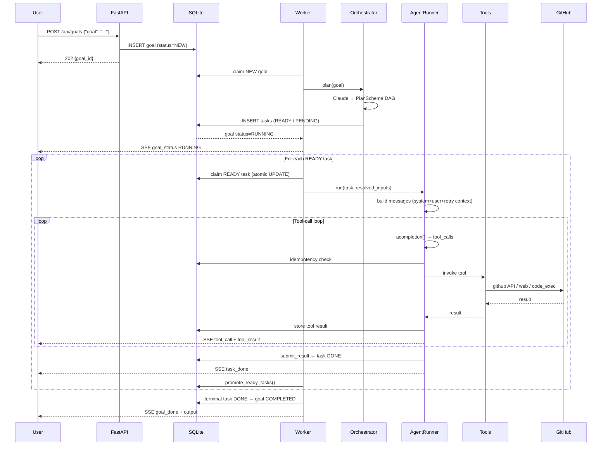
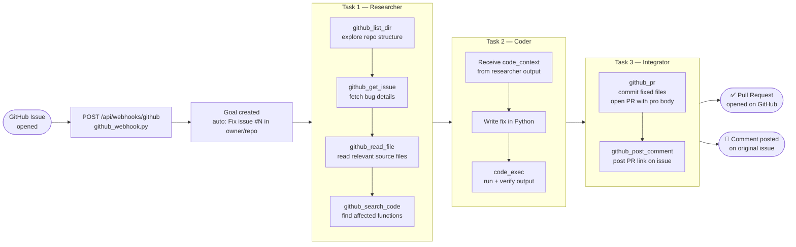
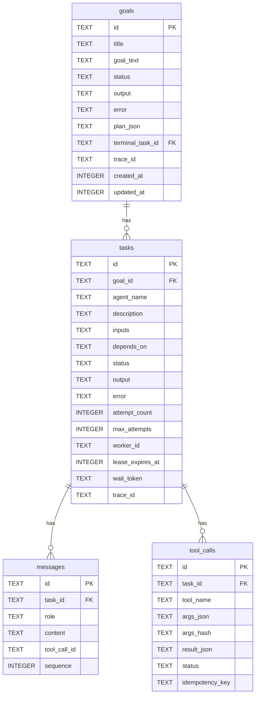
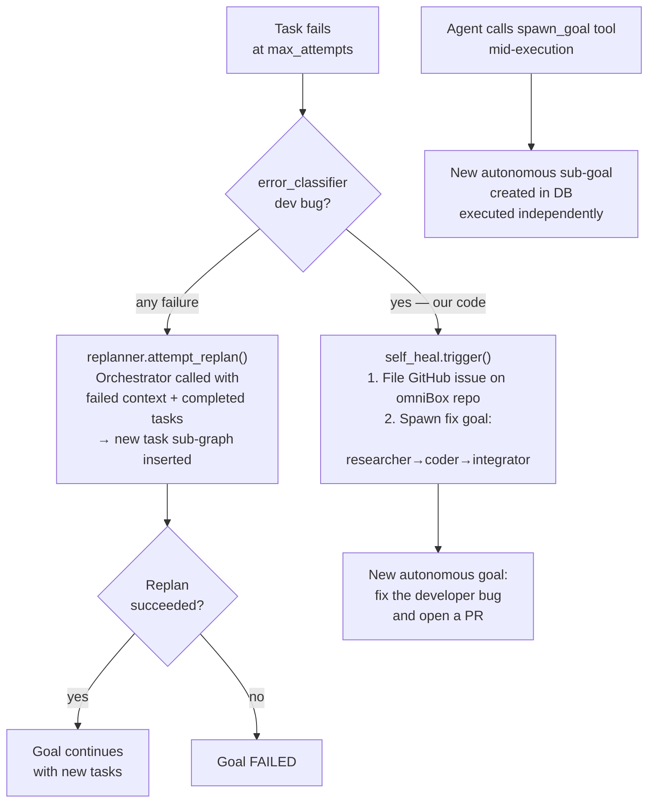

# omniBox — Architecture

## System Overview

```mermaid
flowchart TD
    User(["👤 User / GitHub Webhook"])

    subgraph Frontend ["Frontend — React + Vite :3000"]
        Landing["Landing Page\n/"]
        Dashboard["Dashboard\n/app"]
        GoalDetail["Goal Detail\n/app/goals/:id"]
        Models["Models Config\n/app/models"]
        Automate["GitHub Automation\n/app/webhooks"]
        Actions["Actions & Rulesets\n/app/actions"]
        SSEHook["useSSE() hook\nEventSource auto-reconnect"]
    end

    subgraph API ["FastAPI — :8000"]
        GoalsAPI["POST /api/goals\nGET  /api/goals\nGET  /api/goals/:id"]
        StreamAPI["GET /api/goals/:id/stream\nSSE event stream"]
        WebhookAPI["POST /api/webhooks/github\nGitHub event receiver"]
        ModelsAPI["GET/PUT /api/config/models\nGET/PUT /api/config/keys"]
        ActionsAPI["GET /api/actions/workflows\nGET /api/actions/protection\nPOST /api/actions/goal"]
    end

    subgraph Worker ["asyncio Worker Loops"]
        Planner["goal_planner_loop\npoll NEW goals"]
        Executor["task_executor_loop\npoll READY tasks\nSemaphore(5)"]
        Reclaim["reclaim_loop\nevery 30s — restore stale leases"]
    end

    subgraph Orchestrator ["Orchestrator — orchestrator.py"]
        Claude["LLM Call\nGroq / Claude"]
        PlanSchema["PlanSchema\ntasks DAG + terminal"]
        Validate["_validate_plan()\n_auto_fill_deps()"]
    end

    subgraph AgentRunner ["Agent Runner — agent_runner.py"]
        Loop["Tool-call loop\nacompletion()"]
        Idempotency["Idempotency check\nSHA256 hash → tool_calls table"]
        ToolInvoke["Tool invocation"]
        SubmitResult["submit_result\n→ task DONE"]
    end

    subgraph Agents ["Specialist Agents"]
        Researcher["🔍 Researcher\nGroq LLaMA 4 Maverick\nweb_search · github_*\nspawn_goal"]
        Writer["✍️ Writer\nGroq LLaMA 3.3 70B\nfile_ops"]
        Coder["💻 Coder\nGroq LLaMA 3.3 70B\ncode_exec · file_ops\ngithub_read_file"]
        Integrator["🔗 Integrator\nGroq LLaMA 3.3 70B\ngithub_pr · github_post_comment\ngithub_create_repo\ngithub_set_branch_protection\nwait_webhook · spawn_goal"]
    end

    subgraph Tools ["Tool Layer — tools/"]
        WebSearch["web_search\nTavily → DuckDuckGo fallback"]
        HttpReq["http_request\nhttpx"]
        GithubOps["github_ops\nread_file · list_dir · get_issue\npost_comment · search_code\nlist_workflows · get/set protection"]
        GithubPR["github_pr\nPyGithub — fork if no push access"]
        CodeExec["code_exec\nasyncio subprocess 30s"]
        FileOps["file_ops\nworkspace/{goal_id}/ scoped"]
        SpawnGoal["spawn_goal\ncreates sub-goal autonomously"]
        WaitWebhook["wait_webhook\nsuspends to WAITING_WEBHOOK"]
    end

    subgraph DB ["SQLite WAL — omnibox.db"]
        Goals[("goals\nid · status · plan_json\nterminal_task_id · trace_id")]
        Tasks[("tasks\nid · agent_name · inputs\ndepends_on · status\nattempt_count · lease_expires_at")]
        Messages[("messages\nrole · content · sequence")]
        ToolCalls[("tool_calls\ntool_name · args_hash\nresult_json · status")]
    end

    subgraph Resilience ["Resilience & Autonomy"]
        Replanner["Dynamic Replanner\nreplanner.py\nalternative plan on failure"]
        SelfHeal["Self-Heal\nself_heal.py\nauto-file issue + spawn fix goal"]
        ErrClass["Error Classifier\nerror_classifier.py\ndev bug vs external error"]
    end

    subgraph LLM ["LLM Layer — llm.py + LiteLLM"]
        FallbackChain["Provider Fallback Chain\nGroq → Anthropic"]
        SoftLimit["Soft rate limit\nsleep retry-delay"]
        HardLimit["Hard quota\ntry next model"]
    end

    subgraph Tracing ["Tracing — Omium SDK"]
        GoalTrace["goal_trace_context\nexecution_id = trace_id"]
        OrchestratorSpan["orchestrator span"]
        TaskSpan["task spans"]
        ToolSpan["tool spans"]
    end

    User -->|"submit goal / webhook"| API
    Dashboard -->|"POST /api/goals"| GoalsAPI
    GoalDetail --> SSEHook --> StreamAPI
    Models --> ModelsAPI
    Automate --> WebhookAPI
    Actions --> ActionsAPI

    GoalsAPI --> DB
    WebhookAPI -->|"auto-create goal"| DB

    Planner -->|"claim NEW"| Goals
    Planner --> Orchestrator
    Orchestrator --> Claude --> PlanSchema --> Validate
    Validate -->|"insert tasks"| Tasks

    Executor -->|"claim READY"| Tasks
    Executor --> AgentRunner
    AgentRunner --> Loop --> Idempotency --> ToolInvoke --> SubmitResult
    SubmitResult -->|"DONE + output"| Tasks

    Loop --> Agents
    Researcher & Writer & Coder & Integrator --> Tools

    Tools --> DB
    Tools --> GithubOps & GithubPR & WebSearch & CodeExec

    Tasks -->|"promote deps"| Tasks
    Tasks -->|"terminal DONE"| Goals

    Goals & Tasks & Messages & ToolCalls --> DB

    AgentRunner -->|"emit SSE events"| StreamAPI

    Executor -->|"failure at max_attempts"| ErrClass
    ErrClass -->|"dev bug"| SelfHeal
    ErrClass -->|"any failure"| Replanner

    LLM --> FallbackChain --> SoftLimit & HardLimit

    Tracing --> GoalTrace --> OrchestratorSpan --> TaskSpan --> ToolSpan
```



---

## Request Lifecycle



---

## GitHub Automation Pipeline



---

## Agent Registry

| Agent | Model | Tools | Output |
|-------|-------|-------|--------|
| **researcher** | `groq/meta-llama/llama-4-maverick-17b-128e-instruct` | web_search, http_request, github_read_file, github_list_dir, github_get_issue, github_search_code, github_list_workflows, github_get_branch_protection, spawn_goal | `{summary, key_points, sources, code_context}` |
| **writer** | `groq/llama-3.3-70b-versatile` | file_ops | `{text, title}` |
| **coder** | `groq/llama-3.3-70b-versatile` | code_exec, file_ops, web_search, github_read_file | `{code, output, success}` |
| **integrator** | `groq/llama-3.3-70b-versatile` | github_pr, github_post_comment, github_read_file, github_create_repo, github_list_workflows, github_get_branch_protection, github_set_branch_protection, http_request, wait_webhook, spawn_goal | `{action, result, url}` |

---

## Database Schema



---

## Autonomy & Resilience



---

## File Structure

```
omniBox/
├── backend/
│   ├── main.py                  # FastAPI app, lifespan, router registration
│   ├── config.py                # pydantic-settings, .env loading
│   ├── db.py                    # SQLite WAL, schema DDL, all async queries
│   ├── models.py                # Pydantic request/response schemas
│   ├── state.py                 # GoalRow, TaskRow dataclasses
│   ├── orchestrator.py          # LLM → PlanSchema, _validate_plan, replanning
│   ├── worker.py                # 3 asyncio loops: planner, executor, reclaim
│   ├── agent_registry.py        # AGENT_REGISTRY, get_agent_config()
│   ├── agent_runner.py          # Generic tool-call loop, idempotency, retry context
│   ├── llm.py                   # LiteLLM acompletion, fallback chains
│   ├── interpolation.py         # {{task_id.output.field[0]}} resolver
│   ├── model_config.py          # Per-role model store, model_config.json
│   ├── error_classifier.py      # Dev bug vs external error detection
│   ├── replanner.py             # Dynamic replan on task failure
│   ├── self_heal.py             # Auto-file issue + spawn fix goal
│   ├── events.py                # asyncio.Queue per goal for SSE
│   ├── tracing.py               # Omium SDK wrappers, no-op fallback
│   ├── context.py               # Per-goal context store
│   ├── tools/
│   │   ├── __init__.py          # TOOL_REGISTRY
│   │   ├── web_search.py        # Tavily + DuckDuckGo fallback
│   │   ├── http_request.py      # httpx outbound
│   │   ├── file_ops.py          # workspace-scoped file I/O
│   │   ├── github_pr.py         # PyGithub PR creation, auto-fork
│   │   ├── github_ops.py        # read_file, list_dir, get_issue, post_comment,
│   │   │                        # search_code, list_workflows, get/set protection
│   │   ├── code_exec.py         # asyncio subprocess, 30s timeout
│   │   ├── spawn_goal.py        # agent-initiated sub-goal creation
│   │   └── wait_webhook.py      # suspend task to WAITING_WEBHOOK
│   └── api/
│       ├── goals.py             # CRUD for goals
│       ├── tasks.py             # task detail endpoints
│       ├── stream.py            # SSE /goals/:id/stream
│       ├── webhooks.py          # /webhooks/:token resume
│       ├── github_webhook.py    # /webhooks/github receiver
│       ├── actions.py           # /actions/* — workflows + protection + goal
│       ├── keys.py              # /config/keys — API key management
│       └── health.py            # /health
│
└── frontend/
    ├── src/
    │   ├── pages/
    │   │   ├── Landing.tsx      # Public marketing page
    │   │   ├── Login.tsx        # Firebase auth (email + OAuth)
    │   │   ├── Dashboard.tsx    # Goal list + submission
    │   │   ├── GoalDetail.tsx   # DAG + task panels + live log + output
    │   │   ├── Models.tsx       # Model config + API keys
    │   │   ├── Webhooks.tsx     # GitHub Automation setup + simulator
    │   │   └── Actions.tsx      # CI/CD workflows + branch protection
    │   ├── components/
    │   │   ├── AppNav.tsx       # Sticky nav bar for /app pages
    │   │   ├── AppBackground.tsx # Shared dot-grid + ambient orb background
    │   │   ├── GoalInput.tsx    # Animated placeholder textarea
    │   │   ├── GoalCard.tsx     # Goal row with status + live glow
    │   │   ├── TaskDAG.tsx      # React Flow DAG visualization
    │   │   ├── TaskPanel.tsx    # Expandable task detail (messages, tools)
    │   │   ├── StatusBadge.tsx  # Animated status pill
    │   │   ├── AgentBadge.tsx   # Colored agent type pill
    │   │   ├── LiveLog.tsx      # SSE event feed (monospace scroll)
    │   │   ├── OutputDisplay.tsx # Markdown + Mermaid diagram renderer
    │   │   └── ModelErrorBanner.tsx # Modal on quota/key errors
    │   └── lib/
    │       ├── api.ts           # fetch wrappers for all endpoints
    │       ├── sse.ts           # useSSE() EventSource hook
    │       └── firebase.ts      # Firebase app + auth providers
    └── tailwind.config.js       # Design tokens: colors, fonts, shadows
```
